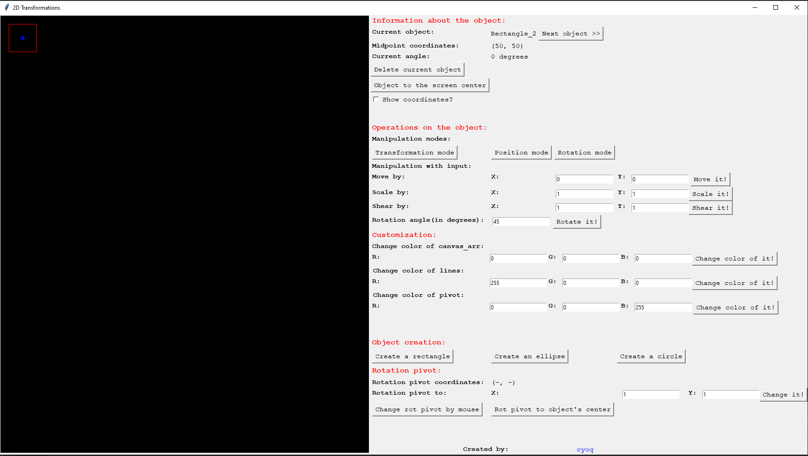

## 2D Transformations
This project was made to understand the mathematics behind 2D transformations, like rotation, translation, scaling and shearing. 

For this purpose **numpy** library was mostly used to draw geometric figures on the 2D canvas matrix.

**Tkinter** was used to create GUI to control transformations and to draw some elements on a canvas.

**Pillow** was used to create an image of numpy array and to show it on a canvas.

The project was run with Python 3.7 and written in PyCharm 2020.

## Project structure
 - [bugs](./bugs) folder contains gifs with interesting bugs which I have encountered while writing this project. 
 - [objects](./objects) folder contains main geometric figures which can be drawn on the canvas. For drawing a line, an ellipse and a circle, Bresenham midpoint algorithm was used.
 - [utils](./utils) folder contains some helper classes for controlling objects on a canvas.
 - [consts.py](./consts.py) contains some constants.
 - [program.py](./program.py) contains the description of all GUI. 
 - [main.py](./main.py) - a start of a program
 
## How to run it?
Be sure to install **numpy** and **pillow**. 

Run:
```
python main.py
```

And the GUI should appear.

## Photo of GUI

